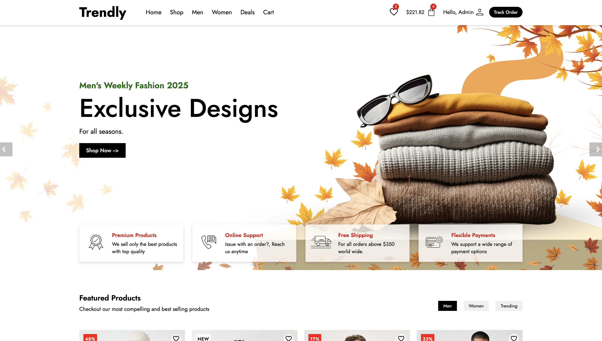
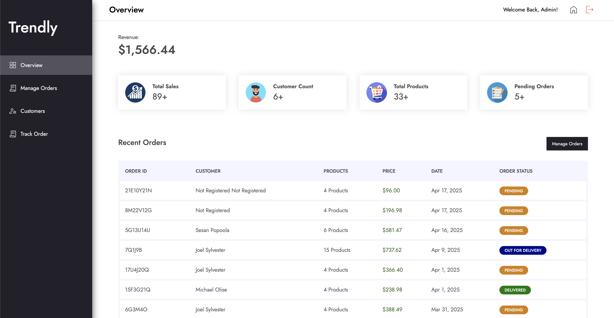
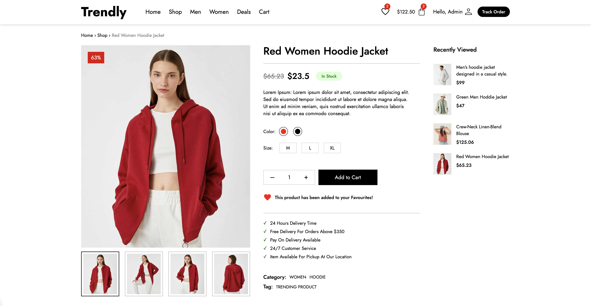
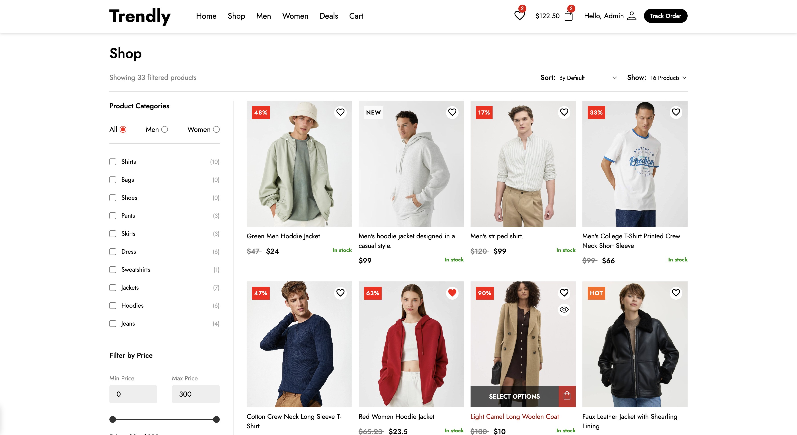

# Trendly

Trendly is a modern Angular-based e-commerce application tailored for a fashion retail experience. It offers a sleek, responsive design and a comprehensive suite of features for customers and administrators, such as user authentication, order management, cart functionality, and product exploration. The app is structured to ensure smooth navigation and optimized performance across different devices.

## Tech Stack

- Frontend Framework: Angular
- Styling: CSS, Angular Animations
- Routing: Angular Router
- HTTP Client: Angular HttpClientModule
- State Management: Local Storage
- Backend Integration: RESTful API (file-based JSON storage)
- Backend Runtime: Node.js with Express

## Key Features

### User Authentication

1. Login and registration screens under auth/
2. LocalStorage-based user session storage
3. Email-based login verification

### Product Management

1. Display all products, single product view, and related products
2. Product filtering by category, price, and status
3. Product images and details fetched from local backend

### Cart System

1. Add to cart from product listings and detail views
2. Dynamic cart total calculation
3. Checkout integration and order submission

### Wishlist

1. Save favorite products using wishlist component
2. Syncs with local storage to retain user preferences

### Order Tracking

1. Search orders by email and order ID
2. View completed order details

### Admin Dashboard

1. View all orders and filter them by status
2. Update order statuses (e.g., pending, shipped)
3. Add new products (in development)

### User Profile

1. View and update user information
2. See order history and saved items

### API Interaction

All product, order, and user data are stored in local JSON files accessed via Express.js backend.

## Local Development Setup

### Clone Repository

git clone <https://github.com/sesanj/Trendly.git>

### Install Dependencies

cd Trendly

npm install

### Run Angular Frontend

ng serve --open

### Start Express Backend

node server.js

Make sure the backend is serving JSON files from /data/ and /images/ folders.

## Future Improvements

- Integrate real-time backend (e.g., MongoDB + Node)
- Implement authentication using JWT
- Add payment gateway integration (Stripe/PayPal)
- Enhance admin features (inventory management, analytics)
- Add image upload support for admin
- Implement pagination and infinite scroll for product listing

## Authors

Developed by:

Sesan Popoola

Aarav Vimalkumar Rathod

Emilin Syju

Lujia Yang

## License

MIT License

Copyright (c) 2024 Trendly

Permission is hereby granted, free of charge, to any person obtaining a copy of this software and associated documentation files (the "Software"), to deal in the Software without restriction, including without limitation the rights to use, copy, modify, merge, publish, distribute, sublicense, and/or sell copies of the Software, and to permit persons to whom the Software is furnished to do so, subject to the following conditions:

The above copyright notice and this permission notice shall be included in all copies or substantial portions of the Software.

THE SOFTWARE IS PROVIDED "AS IS", WITHOUT WARRANTY OF ANY KIND, EXPRESS OR IMPLIED, INCLUDING BUT NOT LIMITED TO THE WARRANTIES OF MERCHANTABILITY, FITNESS FOR A PARTICULAR PURPOSE AND NONINFRINGEMENT. IN NO EVENT SHALL THE AUTHORS OR COPYRIGHT HOLDERS BE LIABLE FOR ANY CLAIM, DAMAGES OR OTHER LIABILITY, WHETHER IN AN ACTION OF CONTRACT, TORT OR OTHERWISE, ARISING FROM, OUT OF OR IN CONNECTION WITH THE SOFTWARE OR THE USE OR OTHER DEALINGS IN THE SOFTWARE.

## Application Images

